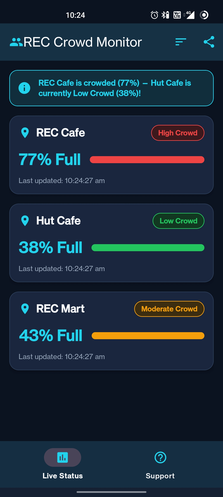
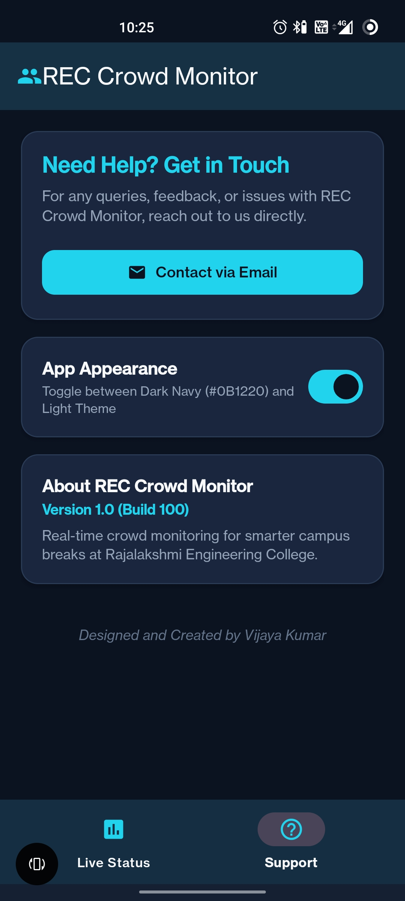

# REC Crowd Monitor — Android Application

**Live crowd status for REC Café, Hut Café, and REC Mart — right on your phone.**

Built for the DEVS Club IoT Task Evaluation, Rajalakshmi Engineering College.

Author: **Vijaya Kumar A** — Mechatronics Engineering Department

📄 Full project documentation & technical report: [REC-CROWD](https://github.com/vijayakumar-14/REC-CROWD)

---

## 📱 About

REC Crowd Monitor is a native Android application that displays real-time, color-coded crowd status for three campus locations, so students can pick the least crowded spot before walking there.

Built using **Google AI Studio** and compiled into an installable APK via **Android Studio**.

---

## 📸 Screenshots

<p align="center">
  
  &nbsp;&nbsp;
  
</p>

<p align="center">
  <em>Left: Live Status tab showing real-time crowd levels at REC Cafe, Hut Cafe, and REC Mart. Right: Support tab.</em>
</p>

---

## ✨ Features

- **Live Status tab** — real-time color-coded crowd status (🟢 Low / 🟡 Moderate / 🔴 High) for REC Cafe, Hut Cafe, and REC Mart, with occupancy percentage and last-updated timestamp.
- **Auto-refresh** — background refresh every 15–20 seconds without a full screen reload.
- **Crowd-alert banner** — suggests a less crowded alternative when a location goes to High Crowd.
- **Pull-to-refresh** — manual refresh gesture on the Live Status screen.
- **Offline handling** — shows last known cached status with a clear "offline" label when there's no connection.
- **Sort/filter** — sort locations by "Least Crowded First."
- **Share status** — share current crowd status via any installed messaging app.
- **Dark/Light theme toggle.**
- **Support tab** — one-tap email to the developer for queries/feedback, plus app info.

---

## 🏗️ Architecture

```
Sensor Layer (hardware, see REC-CROWD repo)
        ↓  MQTT / HTTP
Firebase Realtime Database
        ↓  Realtime listeners
CrowdDataRepository (Java interface)
        ↓
Live Status Fragment  ←→  Support Fragment
        ↓
MainActivity (Bottom Navigation)
```

Data-fetching logic is isolated in a single `CrowdDataRepository` class. The app currently runs on **simulated data** that mirrors the intended Firebase structure, so it's fully demoable without live sensor hardware — swapping in real Firebase data later requires minimal code changes.

---

## 🛠️ Tech Stack

| Layer | Technology |
|---|---|
| Language | Java |
| UI | AndroidX, Material Components (Material Design 3) |
| Backend (planned) | Firebase Realtime Database |
| Notifications (planned) | Firebase Cloud Messaging |
| Min SDK | 24 |
| Build tool | Android Studio (Gradle) |

---

## 📂 Project Structure

```
app/
├── src/main/java/com/vijayakumar/reccrowdmonitor/
│   ├── MainActivity.java
│   ├── LiveStatusFragment.java
│   ├── SupportFragment.java
│   ├── model/
│   │   └── LocationStatus.java
│   └── repository/
│       └── CrowdDataRepository.java
├── src/main/res/
│   ├── layout/
│   ├── drawable/
│   ├── values/ (strings.xml, colors.xml, themes.xml)
└── build.gradle
```

---

## ▶️ Building the APK

1. Clone this repository:
   ```
   git clone https://github.com/vijayakumar-14/REC-CROWD-APPLICATION.git
   ```
2. Open the project folder in **Android Studio**.
3. Let Gradle sync complete (first sync may take a few minutes).
4. Build the APK:
   `Build → Build Bundle(s)/APK(s) → Build APK(s)`
5. The generated APK will be under `app/build/outputs/apk/`.

> **Note:** To connect real live sensor data instead of the built-in simulated data, add your own `google-services.json` (from your Firebase console) into the `app/` folder. The app works fully on simulated data without this step.

---

## 🎨 Design

Dark theme with cyan/teal accents, Material Design 3 components, rounded cards, and status colors:
- 🟢 Green `#22C55E` — Low Crowd
- 🟡 Amber `#F59E0B` — Moderate Crowd
- 🔴 Red `#EF4444` — High Crowd

---

## 📬 Support

For queries or feedback, use the in-app **Support tab**, or email: **vijayakumar.arunachalam2007@gmail.com**

---

## 🔗 Related Repository

- **Documentation, technical report, diagrams, BOM & cost estimation:** [REC-CROWD](https://github.com/vijayakumar-14/REC-CROWD)

---

**Designed and Created by Vijaya Kumar A**
